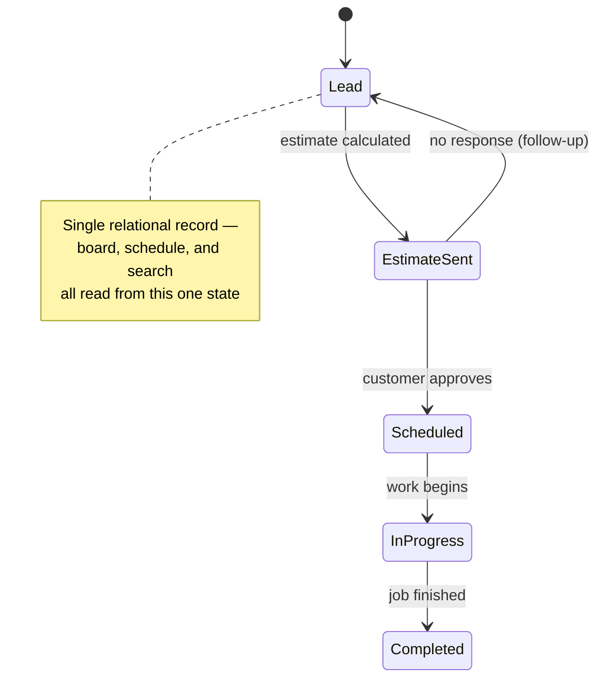

# Home Exterior Job Pipeline & Estimate Tracker


A full-stack job pipeline tracker for home-exterior contractors (windows, doors, siding, gutters) — replacing scattered texts, paper, and memory with one relational source of truth for leads, estimates, and schedules.

**[Live demo →](https://home-exterior-pipeline-tracker.vercel.app/)**

## Why this exists

Contractors running windows/doors/siding/gutter jobs lose time and money when leads, estimates, and schedules live scattered across texts, paper, and memory — a lead goes cold because no one wrote it down, or two people quote the same job differently because there's no single record of what was promised. The fix isn't a nicer-looking spreadsheet; it's modeling the job lifecycle itself as one relational structure so every view of the business — board, schedule, search — reads from the same source of truth.

## How it's built

**Design** — Modeled the job lifecycle (lead → estimate → scheduled → completed) as a single relational structure in Postgres before touching UI, so the pipeline board, weekly schedule, and search all read from one source of truth instead of duplicated state.

**Build** — Used AI to scaffold the pipeline board, estimate calculator, and filtering UI quickly, while owning the estimate logic directly — the part where correctness affects a contractor's bottom line.

**Improve** — The estimate calculator handled populated fields fine but silently produced wrong totals on blank optional dates. Replaced that field with a deterministic formula with explicit null-handling rather than patching the AI-generated logic. Financial calculations in this app now never run through unreviewed AI-generated logic.

## Architecture



## Features

- Board, List, and Dashboard views of the job pipeline
- Job creation/editing, per-service estimate calculator (windows, doors, siding, gutters)
- Search and filtering by service type or stage
- Responsive layout, light/dark theme (remembers choice, follows OS default)

## Tech stack

- **Frontend:** Next.js (App Router), React, Tailwind CSS
- **Database:** PostgreSQL (Neon) + Prisma ORM
- **Backend:** Next.js Server Actions — no separate API layer

## Running it locally

```bash
git clone <repo-url>
cd home-exterior-pipeline-tracker
npm install
```

Set up your `.env` with a Postgres connection string (Neon or local):

Then run migrations and start the dev server:

```bash
npx prisma migrate dev
npm run dev
```

Open `http://localhost:3000`.

## Production build

```bash
npm run build
npm run start
```

## Possible next steps

- Multi-contractor accounts with per-user job assignment
- SMS/email notifications when a job moves stages
- Export estimates as a client-facing PDF
